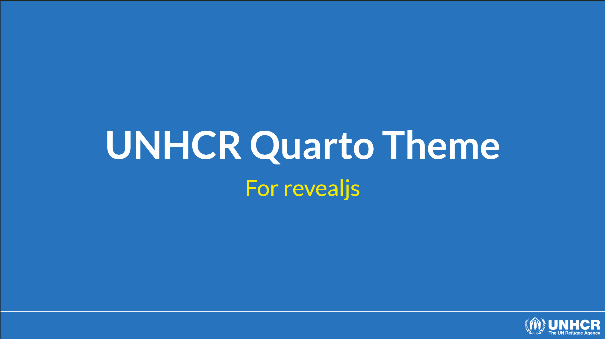

# UNHCR Quarto Reveal.js template

A [Quarto](https://quarto.org/) extension to create [UNHCR branded](https://www.unhcr.org/brand) `reveal.js` presentations.



## Installing

To start a new presentation:

```bash
quarto use template unhcr-dataviz/quarto-revealjs-unhcr
```

This will install the extension and create an example qmd file that you can use as a starting place for your article. _TODO_: Develop example on how to use it and specific CSS class.

## Documentation

Read the [Quarto documentation on reveal.js format](https://quarto.org/docs/presentations/revealjs/)

## Example

Here is the [source code](template.qmd) and the [live example](https://unhcr-dataviz.github.io/quarto-revealjs-unhcr/#/title-slide) of the [template.qmd](template.qmd) file.
